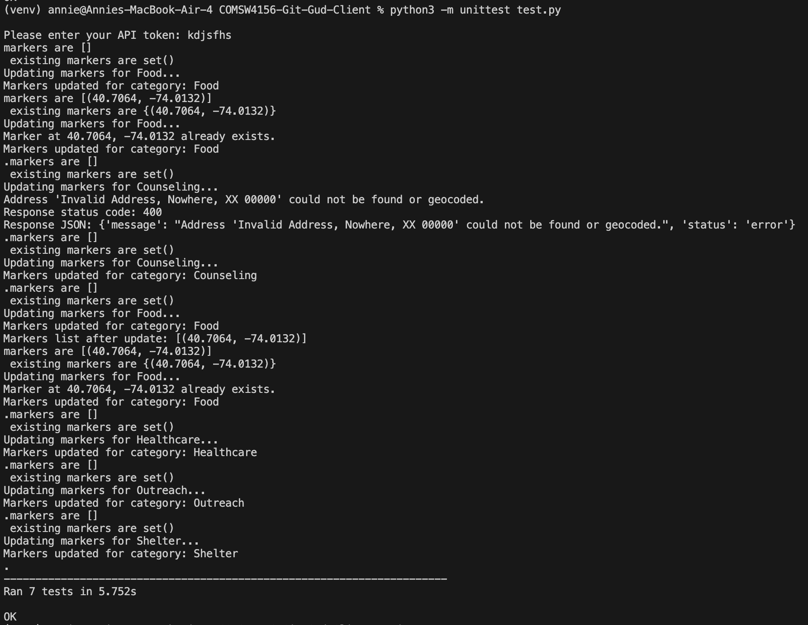

# COMSW4156-Git-Gud-Client

Welcome to the Git Gud Client side of the Git Gud Service. The client is a web application that allows users to visualize essential social welfare resources on a Folium map. This client connects to the **Git Gud API**, which centralizes various social services to assist vulnerable groups, such as homeless individuals, refugees, veterans, and those recovering from substance use. By providing a dynamic map, users can access information about resources like shelter, food distribution, healthcare, counseling, and outreach services in real time.

# How It Works

1. API Integration: The client communicates with the Git Gud API, subscribing to updates for social welfare resources. When new data is available (e.g., a new shelter, food distribution point, healthcare facility, etc.), the map will be updated to reflect the changes.

2. Color-Coded Markers: Each type of resource is displayed as a color-coded marker on the map:
- Blue: Counseling services
- Green: Food resources
- Red: Healthcare facilities
- Purple: Outreach programs
- Orange: Shelters

3. Resource Details: When a user clicks on a marker, detailed information about the resource is displayed, such as the name of the resource, description, phone number, hours of operation, and the address.

4. Dynamic Updates: The client will get real-time updates from the API and automatically adds markers on the map as new resources become available.

The image below shows the map interface:

# Libraries Used:
1. Folium: Used for creating interactive maps and visualizing resource locations with markers.
2. Pandas: Used for data manipulation and handling datasets related to resources.
3. Geopy: Used for geocoding addresses and coordinates to display resources on the map.
4. Requests: Used to interact with the Git Gud API and fetch resource data.
5. Flask: A lightweight web framework used for building the backend server.

# Running the Application

To run the Flask application (`main.py`), use the following command:
`python3 main.py`

This will start the Flask server locally. Ensure the server is running before testing or using the endpoints.

The JWT token should be provided in the Authorization header, as shown below:

`headers = {"Authorization": "Bearer <your-jwt-token>"}`

Replace <your-jwt-token> with the actual JWT token value.

# Running Unit Tests

To run the unit tests with unittest, use the following command:
`python3 -m unittest test.py`

This will execute the tests defined in test.py and output the results in your terminal.

